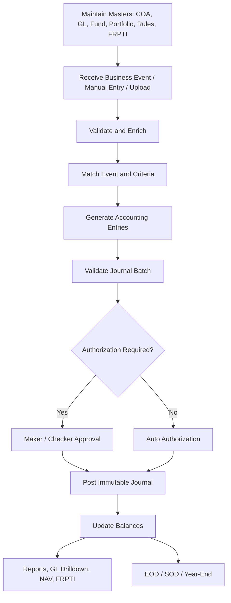

# Business Requirements Document

**Project:** AI-Friendly Enterprise GL and Posting Engine for Wealth, Trust, and Fund Accounting  
**Document version:** 1.0  
**Prepared date:** 20 April 2026  
**Deliverable type:** Business Requirements Document  
**Primary audience:** Business stakeholders, product owners, accounting SMEs, engineering leads, QA, auditors, and implementation partners

---

## 1. Source Basis

This BRD is based on the uploaded Product Adoption Documents and converts their requirements into a modern target-state product backlog.

| Source document | Requirements extracted |
|---|---|
| `GL_ProductAdoption_Doc_CBC_Ver1.6.docx` | GL creation and maintenance, journal posting, cancellation, trust financial statements, EOD, FCY revaluation, year-end processing, GL drilldown, portfolio tagging gaps, FRPTI extraction gap. |
| `Accounting_PAD_v1.2_clean.docx` | Event definition, criteria definition, accounting entry definition, online/batch processing, accounting rule flexibility, accrual/valuation rule gaps, rule attributes. |
| `CBC-Intellect Product Adoption Document_Fund Accounting Module_V1.3.docx` | Fund accounting, maker/checker, GL heads, accounting rules, transaction entry/upload, authorization, reversal, charges/fees, NAV, valuation, amortization, portfolio classification, EOD/SOD, reports. |
| `FRPTI_PAD_v1.1.docx` | FRPTI report sections, quarterly frequency, amount rules, RBU/FCDU/EFCDU structure, contractual relationships, counterparty classifications, supporting schedules. |

---

## 2. Executive Summary

The business requires an enterprise-grade General Ledger and Posting Engine that supports wealth management, trust banking, fund accounting, regulatory reporting, and AI-assisted product development.

The system must be capable of receiving transactions from upstream systems, generating accounting entries through configurable event and criteria rules, posting balanced journal batches, supporting manual adjustments with maker/checker, performing EOD/NAV/FX/year-end accounting, and producing financial and regulatory reports.

The system must specifically address gaps identified in the source documents:

1. Portfolio/accounting-unit tagging of GL postings.
2. FRPTI-ready GL mapping and data extraction.
3. Business-user maintainable accounting rules.
4. Accrual and valuation accounting criteria.
5. Multi-dimensional GL drilldown.
6. AI-safe development and change controls.

---

## 3. Business Objectives

| Objective ID | Objective |
|---|---|
| BO-01 | Provide a single enterprise GL foundation for wealth, trust, and fund accounting. |
| BO-02 | Enable event-driven accounting where new products or accounting changes do not require source-code changes. |
| BO-03 | Support online, batch, manual, EOD, NAV, FX revaluation, and year-end postings. |
| BO-04 | Support GL balances and reporting by accounting unit, portfolio, fund, customer, account, contract, security, currency, and FRPTI classification. |
| BO-05 | Provide maker/checker controls for manual transactions, uploads, master data, reversals, and sensitive operations. |
| BO-06 | Produce trust financial statements, trial balance, NAV/NAVPU, GL drilldown, and FRPTI reporting extracts. |
| BO-07 | Support foreign currency accounting and daily FCY revaluation. |
| BO-08 | Establish guardrails so AI-assisted development improves speed without compromising accounting correctness. |

---

## 4. Scope

### 4.1 In Scope

1. Chart of Accounts and GL master maintenance.
2. GL category and hierarchy maintenance.
3. GL access code mapping.
4. FRPTI mapping.
5. Accounting unit and portfolio tagging.
6. Event, criteria, and accounting entry rule definition.
7. Online posting API.
8. Manual journal posting.
9. Batch transaction upload.
10. Transaction authorization.
11. Transaction cancellation and reversal.
12. Immutable journal ledger.
13. Balance computation and snapshots.
14. FX rate maintenance.
15. FCY revaluation.
16. EOD/SOD processing hooks.
17. Year-end P/L transfer.
18. Fund accounting support.
19. Fee, charge, accrual, amortization, and valuation postings.
20. NAV draft and final processing support.
21. Portfolio classification and closure accounting support.
22. GL drilldown and ledger query.
23. Trust financial statements and trial balance.
24. FRPTI data mart/extract.
25. Audit trail and control reports.
26. AI development guardrails and test strategy.

### 4.2 Out of Scope for Initial Release

1. Full replacement of upstream wealth management, R&TA, mutual fund, or core banking systems.
2. Client onboarding and KYC workflows except dimensions required for accounting/reporting.
3. Full regulatory submission portal to BSP unless separately specified.
4. Tax filing workflows beyond accounting entries and report data.
5. Full ERP procurement, inventory, HR, or payroll modules.
6. Investment order management except accounting events generated from trades/positions.

---

## 5. Stakeholders and Actors

| Actor | Responsibilities |
|---|---|
| Back Office User | Create manual journals, uploads, cancellation requests, and operational queries. |
| Back Office Manager | Authorize manual postings, uploads, cancellations, and sensitive operations. |
| Fund Accounting User | Maintain fund accounting transactions, review NAV, fees, accruals, and reports. |
| Fund Accounting Approver | Approve fund accounting entries, reversals, amortization schedules, and final NAV. |
| Accounting SME | Define and validate accounting rules, GL mappings, and posting outcomes. |
| Finance Controller | Own COA, financial statements, period close, and year-end controls. |
| Regulatory Reporting User | Validate FRPTI mappings, quarter-end extracts, and report schedules. |
| Auditor | Review immutable journals, approvals, rule versions, and balance reconciliations. |
| Integration System User | Submit online/batch events from upstream systems. |
| AI-Assisted Developer | Build system features under controlled engineering guardrails. |
| System Administrator | Manage entitlements, configuration, monitoring, and operational support. |

---

## 6. Business Process Overview

---

## 7. Functional Requirements

### 7.1 Master Data and Chart of Accounts

| Req ID | Requirement | Priority | Acceptance Criteria |
|---|---|---|---|
| GL-001 | The system shall allow authorized users to create, modify, view, and close GL categories. | Must | User can maintain GL category code, description, concise description, category type, and bank/Nostro/Vostro flags where applicable. |
| GL-002 | The system shall allow authorized users to maintain GL head hierarchy. | Must | User can define GL hierarchy code, description, parent hierarchy, and parent-child relationships. |
| GL-003 | The system shall allow authorized users to create, modify, and view GL heads. | Must | User can maintain GL head, description, hierarchy, parent GL, book code, GL type, category, contra GL, currency, opening date, and flags. |
| GL-004 | The system shall prevent recreation of an existing GL. | Must | Attempt to add existing GL is rejected or routed to modify mode. |
| GL-005 | The system shall prevent posting to closed GL heads. | Must | Posting fails with clear error when GL is closed. |
| GL-006 | The system shall validate GL type and GL category compatibility. | Must | Income GL must map to income category; expenditure GL must map to expense category. |
| GL-007 | The system shall support currency restriction at GL level. | Must | Posting in disallowed currency is rejected. |
| GL-008 | The system shall support GLs not allowed for manual transaction with effective dates. | Must | Manual posting to restricted GL is blocked from effective date. |
| GL-009 | The system shall support GL-to-FRPTI mapping. | Must | FRPTI extract can identify mapped report line/schedule for relevant journal/balance. |
| GL-010 | The system shall support GL-to-financial-statement mapping. | Must | Balance sheet, income statement, and trial balance can be generated using mapping. |

### 7.2 Accounting Dimensions

| Req ID | Requirement | Priority | Acceptance Criteria |
|---|---|---|---|
| DIM-001 | The system shall support accounting unit as a core posting dimension. | Must | Every posted journal line has accounting unit. |
| DIM-002 | The system shall support portfolio tagging for wealth/trust postings. | Must | Upstream and manual postings can carry portfolio code. |
| DIM-003 | The system shall support fund-level and portfolio-level balances. | Must | User can query balances by fund and portfolio. |
| DIM-004 | The system shall support customer, account, and contract dimensions. | Must | Journal lines can be linked to customer/account/contract where applicable. |
| DIM-005 | The system shall support security, issuer, counterparty, custodian, and asset type dimensions. | Should | Investment and FRPTI reports can use these dimensions. |
| DIM-006 | The system shall support product class and contractual relationship dimensions. | Must | FRPTI reports can classify trust, fiduciary, agency, advisory, and special purpose trust. |
| DIM-007 | The system shall support holding classification dimension. | Must | Accounting rules can differ for HTM, AFS, HFT, FVPL, FVTPL, FVOCI, and HTC. |

### 7.3 Event and Accounting Rule Definition

| Req ID | Requirement | Priority | Acceptance Criteria |
|---|---|---|---|
| AE-001 | The system shall allow event definitions by product, event code, and event name. | Must | Event can be selected during criteria definition. |
| AE-002 | The system shall allow criteria definitions based on event attributes. | Must | Criteria can use field name, relation, and value/expression. |
| AE-003 | The system shall allow default accounting entries for an event/criteria. | Must | Matching event produces configured journal lines. |
| AE-004 | The system shall allow exception accounting entries. | Must | Higher-priority criteria override default criteria where configured. |
| AE-005 | The system shall support accounting rule versioning and effective dates. | Must | Historical events use correct rule version based on effective date. |
| AE-006 | The system shall allow amount fields and amount expressions. | Must | Rule can use transaction amount, gain, loss, fee, tax, commission, or expression. |
| AE-007 | The system shall support Dr/Cr based on sign. | Must | Positive and negative amount behavior can be configured. |
| AE-008 | The system shall support criteria for daily accrued interest entries. | Must | Daily accrual events can generate accounting entries based on configured criteria. |
| AE-009 | The system shall support criteria for valuation accounting entries. | Must | Price update or valuation event can trigger configured accounting entries. |
| AE-010 | The system shall allow business users to define accounting rules post-live under controlled approval. | Should | Authorized business user can create rule draft, simulate, submit for approval, and activate after approval. |

### 7.4 Posting and Journal Entry

| Req ID | Requirement | Priority | Acceptance Criteria |
|---|---|---|---|
| POST-001 | The system shall accept postings from upstream systems through API. | Must | Certified upstream system can submit event and receive posting status. |
| POST-002 | The system shall support manual journal postings. | Must | User can create adjustment posting with debit/credit lines and narration. |
| POST-003 | The system shall support batch/file upload postings. | Must | User can upload file, validate records, and submit for authorization. |
| POST-004 | The system shall group journal lines into a transaction batch. | Must | Batch has batch number and batch serial lines. |
| POST-005 | The system shall ensure every transaction batch is balanced. | Must | Unbalanced batch cannot be posted. |
| POST-006 | The system shall support transaction code validation. | Must | Invalid transaction code is rejected. |
| POST-007 | The system shall support account validation. | Must | Invalid or closed account is rejected. |
| POST-008 | The system shall support contract validation. | Should | Invalid contract is rejected where contract is mandatory. |
| POST-009 | The system shall support conversion rate and base/fund currency equivalent. | Must | Base or fund equivalent is calculated or validated. |
| POST-010 | The system shall store transaction particulars/narration. | Must | User can view narration in ledger drilldown. |
| POST-011 | The system shall support auto-authorization for trusted upstream interface postings. | Must | Interface postings can be auto-approved according to policy. |
| POST-012 | The system shall require authorization for manual and batch postings. | Must | Maker/checker approval required before posting. |
| POST-013 | The system shall support idempotency for upstream events. | Must | Duplicate source event does not create duplicate journal. |

### 7.5 Authorization and Workflow

| Req ID | Requirement | Priority | Acceptance Criteria |
|---|---|---|---|
| AUTH-001 | The system shall support maker/checker for master maintenance. | Must | Maker cannot authorize own master record. |
| AUTH-002 | The system shall support maker/checker for manual journal postings. | Must | Manual journal is pending until approved. |
| AUTH-003 | The system shall support maker/checker for batch uploads. | Must | Uploaded batch is posted only after approval. |
| AUTH-004 | The system shall support approval and rejection with remarks. | Must | Checker can approve or reject and system stores remarks. |
| AUTH-005 | The system shall support filtering authorization queue by module, program, and user. | Should | Approver can filter pending items. |
| AUTH-006 | The system shall prevent last modifier from authorizing modified record. | Must | Last modifying user cannot approve. |

### 7.6 Cancellation and Reversal

| Req ID | Requirement | Priority | Acceptance Criteria |
|---|---|---|---|
| REV-001 | The system shall allow cancellation of posted transaction by batch details. | Must | User can fetch transaction by accounting unit/branch, batch number, and transaction date. |
| REV-002 | The system shall require reason for cancellation. | Must | Cancellation cannot be submitted without reason if configured mandatory. |
| REV-003 | The system shall route cancellation for authorization. | Must | Cancellation is pending until supervisor approval. |
| REV-004 | The system shall create compensating entries for authorized cancellation. | Must | Original journal remains intact and cancellation batch is linked. |
| REV-005 | The system shall support reversal of manual/uploaded transactions. | Must | User can reverse authorized transaction with reason and authorization. |
| REV-006 | The system shall support NAV reversal based on policy. | Should | NAV can be reversed for allowed previous NAV date and recalculated. |
| REV-007 | The system shall support fund EOY reversal under restricted policy. | Should | Authorized user can reverse final EOY where permitted. |

### 7.7 FX Rates and FCY Revaluation

| Req ID | Requirement | Priority | Acceptance Criteria |
|---|---|---|---|
| FX-001 | The system shall maintain currency rate type codes. | Must | User can define rate type code, description, actual/notional, rate flag, and required rate types. |
| FX-002 | The system shall maintain FX rates by currency pair and date. | Must | User can capture purchase, selling, and/or mid rates. |
| FX-003 | The system shall validate FX rates before EOD. | Must | EOD blocks or raises exception if required rates missing. |
| FX-004 | The system shall configure FCY GLs eligible for revaluation. | Must | Revaluation parameter supports GL, effective date, and gain/loss GL. |
| FX-005 | The system shall calculate base-currency equivalent using closing mid-rate. | Must | FCY balance multiplied by rate produces current base equivalent. |
| FX-006 | The system shall post FX gain/loss based on balance nature and rate movement. | Must | Correct debit/credit entries are generated for debit/credit GL balances. |
| FX-007 | The system shall provide currency-wise FCY revaluation reports. | Should | User can view FCY balance, rate, base equivalent, and gain/loss. |

### 7.8 EOD and SOD

| Req ID | Requirement | Priority | Acceptance Criteria |
|---|---|---|---|
| EOD-001 | The system shall support EOD orchestration. | Must | EOD can run configured jobs in controlled sequence. |
| EOD-002 | The system shall perform daily security accruals, amortization, and deposit accruals. | Must | Daily accrual postings generated irrespective of NAV frequency. |
| EOD-003 | The system shall perform mark-to-market valuation during EOD. | Must | MTM entries generated according to portfolio classification. |
| EOD-004 | The system shall perform FX revaluation during EOD. | Must | Eligible FCY GLs are revalued and gain/loss posted. |
| EOD-005 | The system shall generate scheduled financial reports during EOD. | Should | Trust financial statements and snapshots are generated as configured. |
| SOD-001 | The system shall support SOD event processing. | Should | Security redemption, coupon due, and deposit maturity events can be generated. |

### 7.9 Year-End Processing

| Req ID | Requirement | Priority | Acceptance Criteria |
|---|---|---|---|
| YE-001 | The system shall maintain transaction code for year-end P/L transfer. | Must | Year-end cannot run until parameter exists. |
| YE-002 | The system shall maintain income and expense transfer GL parameters. | Must | Income/expense balances are transferred to configured retained earnings/reserve GL. |
| YE-003 | The system shall close income and expense GL balances during year-end. | Must | Post-year-end balances for nominal accounts are zero or as configured. |
| YE-004 | The system shall support fund-level year-end processing. | Should | Fund income/expense accounts can be netted to reserve at fund level. |
| YE-005 | The system shall restrict year-end processing to authorized users. | Must | Only entitled users can run final year-end. |

### 7.10 Fund Accounting and NAV

| Req ID | Requirement | Priority | Acceptance Criteria |
|---|---|---|---|
| FUND-001 | The system shall maintain fund master attributes. | Must | Fund code, name, structure, type, currency, NAV frequency, dates, precision, tax, and account details can be maintained. |
| FUND-002 | The system shall support NAV frequency configuration. | Must | Daily, all-days, weekly, and monthly schedules can be derived. |
| FUND-003 | The system shall support NAV rounding configuration. | Must | NAV/NAVPU can use round off, round up, or no round off with configured decimals. |
| FUND-004 | The system shall support tax-on-interest parameter at fund level. | Must | Interest tax accrual can be enabled/disabled by fund. |
| FUND-005 | The system shall compute draft NAV without posting accounting entries. | Must | Draft NAV can run multiple times and does not create fee postings. |
| FUND-006 | The system shall compute final NAV and post accounting entries. | Must | Final NAV posts computed fee entries and freezes NAV date. |
| FUND-007 | The system shall perform NAV pre-checks. | Must | Unauthorized records, masters, unconfirmed deals, unsettled deals, price upload, and FX upload checks are performed. |
| FUND-008 | The system shall support NAV reversal. | Should | Authorized reversal allows draft/final NAV recreation. |
| FUND-009 | The system shall support NAVPU report. | Should | NAVPU report can be generated for all funds as of NAV date. |

### 7.11 Fees, Charges, Accruals, and Amortization

| Req ID | Requirement | Priority | Acceptance Criteria |
|---|---|---|---|
| FEE-001 | The system shall maintain charge codes mapped to GL access codes. | Must | Charge code has description and GL access code. |
| FEE-002 | The system shall maintain charge setup by effective date. | Must | Fixed amount, fixed percentage, variable amount, per amount, and tenor slab supported. |
| FEE-003 | The system shall support NAV-based fee setup. | Must | Fund admin, custody, registry, management, and other fees can be configured. |
| FEE-004 | The system shall support minimum and maximum fee rules. | Should | Monthly/annual min/max fee adjustments can be posted. |
| FEE-005 | The system shall support day-count convention per fee. | Should | 360-day convention can be configured. |
| FEE-006 | The system shall support computed fee override before final NAV. | Should | Revised fee is used for NAV date and normal computation resumes next NAV date. |
| ACCR-001 | The system shall support coupon and deposit interest accruals. | Must | Accrual postings generated daily based on security/deposit parameters. |
| ACCR-002 | The system shall support amortization/recurring entries. | Must | User can define source/destination GL, date range, total amount, per-day amount, and authorization. |
| ACCR-003 | The system shall support cancellation of amortization schedules. | Should | Authorized users can cancel schedules with audit trail. |

### 7.12 Valuation and Portfolio Classification

| Req ID | Requirement | Priority | Acceptance Criteria |
|---|---|---|---|
| VAL-001 | The system shall support valuation parameters by fund and effective date. | Must | Stock exchange and price type priority can be configured. |
| VAL-002 | The system shall support manual fund-wise market price. | Must | Manual price takes priority for valuation. |
| VAL-003 | The system shall use fallback price logic. | Must | If current price missing, system checks prior 3 days; if absent, WAC/cost is used. |
| VAL-004 | The system shall calculate market value and appreciation/depreciation. | Must | Difference between market value and book value is computed. |
| PORT-001 | The system shall support portfolio classification. | Must | Security in fund can be classified as AFS, HFT, HTM, FVPL, FVTPL, FVOCI, HTC. |
| PORT-002 | The system shall prevent same security from two classifications within one fund. | Must | Duplicate classification rejected. |
| PORT-003 | The system shall generate MTM postings based on classification. | Must | AFS/HFT/FV categories post to configured GLs; HTM/HTC do not post MTM. |
| PORT-004 | The system shall support portfolio closure and reversal. | Should | Book value treatment follows classification policy. |

### 7.13 Reporting and Queries

| Req ID | Requirement | Priority | Acceptance Criteria |
|---|---|---|---|
| REP-001 | The system shall provide GL drilldown query. | Must | User can query by accounting unit, GL access code, from date, and to date. |
| REP-002 | The system shall show opening balance, closing balance, and turnover summary. | Must | Query displays balances and movements. |
| REP-003 | The system shall support drilldowns to GL ledger, multi-currency balance, account-level breakup, nominal entries, GL transactions, balance history, and transaction-code breakup. | Should | User can navigate from summary to detailed views. |
| REP-004 | The system shall generate trial balance. | Must | Trial balance can be produced by date/fund/entity as configured. |
| REP-005 | The system shall generate trust balance sheet and income statement. | Must | Reports can be scheduled and manually generated for past dates. |
| REP-006 | The system shall generate NAV summary and NAV breakup reports. | Must | Reports can be exported or viewed. |
| REP-007 | The system shall generate fees and interest accrual reports. | Should | Users can review fees/accruals for period. |
| REP-008 | The system shall generate holding statement and fund factsheet where required. | Should | Fund reports are available by as-of date. |

### 7.14 FRPTI Reporting

| Req ID | Requirement | Priority | Acceptance Criteria |
|---|---|---|---|
| FRPTI-001 | The system shall support quarterly FRPTI reporting data extraction. | Must | Quarter-end extract can be generated. |
| FRPTI-002 | The system shall report amounts in absolute figures with two decimal places. | Must | FRPTI output applies amount formatting rules. |
| FRPTI-003 | The system shall support RBU and FCDU/EFCDU book structure. | Must | Foreign currency accounts can be recorded in FCY and local equivalent. |
| FRPTI-004 | The system shall support USD functional currency for FCDU/EFCDU and PHP presentation consolidation where applicable. | Must | Translation/consolidation data can be produced. |
| FRPTI-005 | The system shall support contractual relationship classification. | Must | Trust, fiduciary, agency, advisory, and special purpose trust classifications available. |
| FRPTI-006 | The system shall support resident/non-resident and sector classification for counterparties. | Must | Issuer/counterparty FRPTI classification is captured and used in reports. |
| FRPTI-007 | The system shall support FRPTI schedules. | Must | Main report, A1/A2, B/B1/B2, C/C1/C2, D/D1/D2, E/E1/E2, and Income Statement data can be mapped. |
| FRPTI-008 | The system shall produce validation exceptions for missing FRPTI mappings. | Must | Missing classifications are reported before final extract. |

### 7.15 Audit, Controls, and Compliance

| Req ID | Requirement | Priority | Acceptance Criteria |
|---|---|---|---|
| AUD-001 | The system shall keep immutable posted journals. | Must | Posted journal lines cannot be edited or deleted. |
| AUD-002 | The system shall trace journal lines to source event and rule version. | Must | User can view source event, payload hash, criteria, and rule version. |
| AUD-003 | The system shall keep maker/checker audit trail. | Must | Maker, checker, timestamps, and decision stored. |
| AUD-004 | The system shall log rule changes. | Must | Rule version history and approvals retained. |
| AUD-005 | The system shall support balance rebuild from journal lines. | Should | Rebuilt balance matches stored balance. |
| AUD-006 | The system shall provide exception and reconciliation reports. | Should | Users can review failed postings, pending approvals, and mismatches. |

### 7.16 AI-Assisted Development Guardrails

| Req ID | Requirement | Priority | Acceptance Criteria |
|---|---|---|---|
| AI-001 | The system shall use explicit API contracts and rule DSL/configuration for accounting behavior. | Must | Accounting behavior is not hidden in arbitrary generated code. |
| AI-002 | Every accounting rule shall have golden test cases. | Must | Rule cannot be activated without expected journal examples. |
| AI-003 | AI-generated code shall not directly update posted journal tables. | Must | Database permissions and code review enforce restriction. |
| AI-004 | All posting engine changes shall run invariant tests. | Must | CI blocks merge if debit/credit, immutability, idempotency, or reversal tests fail. |
| AI-005 | Rule changes shall require business/accounting SME approval. | Must | Rule activation workflow includes SME approval. |
| AI-006 | Pull requests affecting accounting shall reference requirement IDs and test evidence. | Must | PR template enforces traceability. |
| AI-007 | The system shall maintain simulation tools for accounting rule changes. | Should | User can simulate rule against sample/historical event before activation. |

---

## 8. Business Rules

| Rule ID | Business Rule |
|---|---|
| BR-001 | Existing GL cannot be recreated. |
| BR-002 | Closed GL cannot be posted to. |
| BR-003 | GL type and GL category must be compatible. |
| BR-004 | Contra GL head cannot be same as current GL head. |
| BR-005 | All transaction batches must be balanced. |
| BR-006 | Manual postings and batch uploads require authorization unless explicitly configured otherwise. |
| BR-007 | Trusted upstream interface postings may be auto-authorized. |
| BR-008 | Backdated posting is allowed for current financial year subject to controls. |
| BR-009 | Previous financial-year posting requires special configuration and authorization or must be blocked. |
| BR-010 | Cancellation and reversal must create compensating entries; original journal must remain unchanged. |
| BR-011 | FX rates must be available before EOD revaluation. |
| BR-012 | FCY revaluation must update base-currency equivalent without changing FCY balance. |
| BR-013 | Draft NAV must not post accounting entries. |
| BR-014 | Final NAV must post configured accounting entries and freeze NAV for the date. |
| BR-015 | NAV reversal must follow configured date and authorization policy. |
| BR-016 | Same security cannot have two portfolio classifications within a single fund. |
| BR-017 | HTM/HTC securities are valued at cost/amortized cost and do not generate MTM postings. |
| BR-018 | FRPTI extract must flag missing GL, counterparty, or contractual relationship classifications. |
| BR-019 | Maker cannot approve own transaction or own master change. |
| BR-020 | Accounting rules must be versioned and effective-dated. |

---

## 9. Data Requirements

### 9.1 Mandatory Master Data

- GL category.
- GL head.
- GL hierarchy.
- GL access code.
- Accounting unit.
- Currency.
- FX rate type and FX rate.
- Fund master.
- Portfolio master.
- Account and contract master or reference.
- Security master.
- Issuer/counterparty master.
- FRPTI classification.
- Accounting event definitions.
- Criteria definitions.
- Accounting entry definitions.
- Authorization roles and entitlements.

### 9.2 Mandatory Transaction Data

- Source system.
- Source reference.
- Idempotency key.
- Event code.
- Transaction code.
- Transaction date.
- Value date.
- Posting date.
- Accounting unit.
- GL head/access code.
- Debit/credit indicator.
- Amount.
- Currency.
- Conversion rate where applicable.
- Base/fund currency equivalent where applicable.
- Fund/portfolio/account/contract where applicable.
- Narration.
- Maker/checker details where applicable.

---

## 10. Non-Functional Requirements

| NFR ID | Requirement | Target / Acceptance Criteria |
|---|---|---|
| NFR-001 | Availability | Posting services must be available during business and batch windows. |
| NFR-002 | Reliability | Failed jobs must be restartable without duplicate postings. |
| NFR-003 | Idempotency | Duplicate source events must not duplicate journals. |
| NFR-004 | Auditability | Every journal line must trace to source, rule, user/action, and timestamp. |
| NFR-005 | Security | Role-based access, least privilege, encrypted secrets, and audit logs required. |
| NFR-006 | Performance | Online posting should respond within acceptable business SLA; batch should process with row-level errors. |
| NFR-007 | Scalability | Event ingestion, rule evaluation, posting, and reporting should scale independently. |
| NFR-008 | Data integrity | Posted journals immutable; balances rebuildable. |
| NFR-009 | Observability | Metrics, logs, traces, dashboards, and exception queues required. |
| NFR-010 | Maintainability | Accounting behavior should be configurable and testable. |
| NFR-011 | Compliance | Must support accounting standards, financial period controls, and regulatory reporting. |
| NFR-012 | AI safety | AI-assisted code must pass deterministic tests, reviews, and change controls. |

---

## 11. Reporting Requirements Summary

| Report / Query | Description | Frequency |
|---|---|---|
| GL Drilldown | Opening/closing balance and turnover with transaction drilldown. | On demand |
| GL Ledger | Ledger lines by GL/access code/date. | On demand |
| Multi-Currency Balance | Currency-wise balance. | On demand / EOD |
| Account-Level Breakup | Account-level GL breakup. | On demand |
| Balance History | Daily/weekly/monthly movement. | On demand |
| Trial Balance | Trial balance by entity/fund/date. | Daily / period end |
| Trust Balance Sheet | Trust financial statement balance sheet. | Scheduled / on demand |
| Trust Income Statement | Trust financial statement income statement. | Scheduled / on demand |
| NAV Summary | NAV and NAVPU summary. | NAV frequency |
| NAV Breakup | Schedule-wise NAV transaction detail. | NAV frequency / on demand |
| Fees Report | Fees accrued/computed. | NAV / monthly |
| Interest Accrual Ledger | Interest accrual details. | Daily / on demand |
| FX Revaluation Report | FCY GL revaluation results. | Daily EOD |
| FRPTI Extract | Regulatory report data. | Quarterly |
| Audit Trail Report | Maker/checker, rule, and posting trace. | On demand |

---

## 12. Integration Requirements

| Integration | Direction | Requirement |
|---|---|---|
| Wealth platform | Inbound | Send portfolio/accounting-unit tagged events for posting. |
| Mutual/fund accounting | Inbound | Send fund accounting events, NAV-related events, and transaction uploads. |
| R&TA | Inbound | Send subscription/redemption/unit events as required. |
| Core banking / Finacle | Inbound | Send bank/account postings and balances where required. |
| Market price source | Inbound | Provide security prices by exchange and price type. |
| FX rate source | Inbound | Provide daily FX rates; manual entry fallback required. |
| Reporting/data mart | Outbound | Receive posted journal and balance snapshots. |
| ERPNext or ERP | Bidirectional/Outbound | Optional adapter for summarized or mirrored entries. |
| Email/report distribution | Outbound | Optional report delivery for NAVPU or scheduled reports. |

---

## 13. Acceptance Test Themes

1. Create GL category, hierarchy, and GL head with maker/checker.
2. Reject duplicate GL creation.
3. Post balanced manual JV and approve.
4. Reject unbalanced manual JV.
5. Reject manual posting to blocked GL.
6. Auto-authorize trusted upstream posting.
7. Prevent duplicate upstream posting with same idempotency key.
8. Cancel posted transaction and verify compensating batch.
9. Reverse prior transaction and verify audit trail.
10. Run FX revaluation for debit and credit FCY balances.
11. Run draft NAV and verify no postings.
12. Run final NAV and verify fee postings.
13. Run valuation with current price, fallback prior price, and WAC/cost fallback.
14. Run year-end and verify income/expense transfer.
15. Generate GL drilldown and drill to transaction details.
16. Generate trust balance sheet and income statement.
17. Generate FRPTI extract and validate missing mappings report.
18. Rebuild balances from journal and compare stored balance.
19. Change accounting rule version and verify historical rule preservation.
20. Run AI-generated code through accounting invariant test suite and block unsafe change.

---

## 14. Traceability Matrix

| Source theme | BRD requirement areas |
|---|---|
| GL creation and COA | GL-001 to GL-010 |
| Journal posting | POST-001 to POST-013 |
| Cancellation | REV-001 to REV-004 |
| Fund transaction authorization/reversal | AUTH-001 to AUTH-006, REV-005 to REV-007 |
| Accounting engine event/criteria/entry | AE-001 to AE-010 |
| EOD and FCY revaluation | FX-001 to FX-007, EOD-001 to EOD-005 |
| Year-end processing | YE-001 to YE-005 |
| NAV and fund accounting | FUND-001 to FUND-009, FEE-001 to FEE-006, ACCR-001 to ACCR-003 |
| Valuation and portfolio classification | VAL-001 to VAL-004, PORT-001 to PORT-004 |
| GL drilldown and reports | REP-001 to REP-008 |
| FRPTI reporting | FRPTI-001 to FRPTI-008 |
| AI-safe development | AI-001 to AI-007 |

---

## 15. Assumptions

1. Source systems can provide stable unique references for idempotency.
2. Accounting unit and portfolio identifiers will be available from upstream systems or enrichable from master data.
3. Business users/accounting SMEs will own accounting rule definitions and expected journal examples.
4. Existing COA and FRPTI mappings will be cleansed before production migration.
5. FX rates and security prices will be available from external feeds or manual input before EOD.
6. ERPNext, if used, will not override the custom ledger for in-scope wealth/trust/fund postings.
7. Regulatory report output format will be finalized before FRPTI build completion.
8. Historical migration scope will be separately defined.
9. All screens and reports are assumed to be in English unless localization is separately specified.

---

## 16. Open Questions

1. Which entity, fund, and book hierarchy is required for phase 1?
2. What is the target production volume for online postings and batch uploads?
3. Which accounting standards/books are required at go-live?
4. Which source systems are authoritative for portfolio, contract, and customer/account data?
5. Should accounting rules be maintained through UI, configuration files, or both?
6. What tolerance should be allowed for debit/credit equality after currency conversion?
7. What is the approved policy for previous financial-year backdated postings?
8. What period-close workflow is required?
9. What exact FRPTI file/template format is required for submission?
10. Should NAVPU report distribution through email be in scope for phase 1?
11. Which AI coding tools are permitted in the SDLC, and what evidence is required for audit?
12. What level of ERPNext integration is required initially: none, summary mirror, or operational ERP bridge?

---

## 17. Recommended Release Plan

### Release 1 — Core GL and Posting MVP

- COA/GL master.
- Event and rule definitions.
- Manual and API posting.
- Batch upload.
- Maker/checker.
- Immutable journal and balance service.
- GL drilldown.

### Release 2 — Wealth/Trust Dimensions and FRPTI Foundation

- Accounting unit and portfolio tagging.
- Customer/account/contract dimensions.
- FRPTI mapping.
- Trust financial statements.
- FRPTI extract prototype.

### Release 3 — Fund Accounting, NAV, Fees, and Valuation

- Fund master.
- Fees/charges.
- Accruals and amortization.
- Portfolio classification.
- Draft/final NAV.
- NAV reports.

### Release 4 — EOD/SOD, FX, Year-End, and Regulatory Hardening

- EOD/SOD orchestration.
- FX revaluation.
- Year-end/fund year-end.
- FRPTI production schedules.
- Audit and reconciliation dashboards.

### Release 5 — AI-Assisted Rule Operations and Advanced Automation

- Rule simulation workbench.
- Golden accounting test library.
- AI-assisted documentation/test generation.
- Controlled business-user rule maintenance.
- Advanced reconciliation and anomaly detection.
