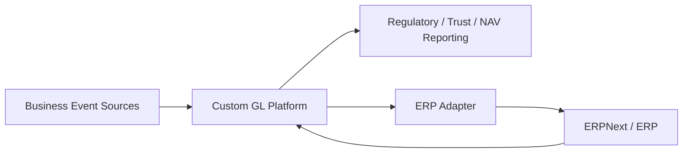

# Enterprise General Ledger Architecture

**Document version:** 1.0  
**Prepared date:** 20 April 2026  
**Target domain:** Wealth management, trust banking, fund accounting, FRPTI reporting, and enterprise GL  
**Intended use:** Architecture blueprint for building an AI-friendly, audit-safe enterprise GL platform that can coexist with, integrate into, or gradually replace an ERP accounting backbone.

---

## 1. Source Basis

This architecture is synthesized from the uploaded Product Adoption Documents and tailored to a modern, event-driven GL platform.

| Source document | Architecture inputs used |
|---|---|
| `GL_ProductAdoption_Doc_CBC_Ver1.6.docx` | Chart of Accounts, GL category/head hierarchy, GL posting, transaction cancellation, trust financial statements, EOD, year-end, GL drilldown, FX revaluation, FRPTI data extraction, portfolio tagging gaps. |
| `Accounting_PAD_v1.2_clean.docx` | Event definition, criteria definition, accounting entry definition, online/batch posting, store-and-forward, accounting independence from GL, accrual/valuation gaps, rule attributes. |
| `CBC-Intellect Product Adoption Document_Fund Accounting Module_V1.3.docx` | Fund master, maker/checker, fund accounting GL, transaction entry/upload, accounting rules, NAV, fees, amortization, valuation, portfolio classification, EOD/SOD, reports. |
| `FRPTI_PAD_v1.1.docx` | BSP FRPTI report structure, quarterly reporting, RBU/FCDU/EFCDU treatment, FRPTI classification, contractual relationship classification, counterparty sector classification. |

This document is not a line-by-line reproduction of the uploaded PADs. It converts them into a target architecture suitable for AI-assisted engineering, strong auditability, and future extension.

---

## 2. Executive Summary

The recommended architecture is a **custom enterprise GL and posting platform** with an event-driven accounting engine, immutable ledger store, strong maker/checker workflows, multi-dimensional ledger balances, and regulatory reporting support.

ERPNext or another ERP may be used as an interim operational ERP layer, but the **strategic source of accounting truth** for wealth, trust, fund accounting, NAV, FRPTI, FX revaluation, and portfolio-level postings should be the custom GL platform.

The core design principle is:

> Business events produce accounting intents. Accounting intents are resolved by versioned accounting rules into balanced journal batches. Journal batches are validated, authorized where required, posted immutably, and exposed to reporting, reconciliation, audit, and downstream systems.

---

## 3. Architecture Goals

### 3.1 Business Goals

1. Support trust banking, wealth management, and fund accounting on a single accounting foundation.
2. Support GL posting from upstream systems such as wealth, mutual fund, registrar/transfer agency, and core banking systems.
3. Support manual journal postings, batch uploads, and system-generated postings with different approval paths.
4. Support portfolio/accounting-unit level posting so balances can be reported at trust, fund, portfolio, customer, and accounting unit levels.
5. Support FRPTI reporting through direct mapping of GL heads, contractual relationships, and counterparty classifications.
6. Support trust financial statements, trial balance, income statement, balance sheet, NAV, NAVPU, and GL drilldown.
7. Support EOD, SOD, month-end, quarter-end, and year-end processing.
8. Support foreign currency GL balances and daily FX revaluation.

### 3.2 Technology Goals

1. Make accounting changes configuration-driven, not code-driven.
2. Support AI-assisted development safely through clean boundaries, explicit contracts, deterministic rules, and extensive automated tests.
3. Keep GL posting atomic, idempotent, auditable, and reversible only through compensating entries.
4. Separate business event capture, accounting rule resolution, posting, balance computation, and reporting.
5. Allow ERPNext or any ERP/accounting package to be integrated through adapters without compromising the enterprise ledger core.

---

## 4. Recommended Target Architecture

```mermaid
flowchart LR
    subgraph Upstream[Upstream & User Channels]
        W[Wealth Platform]
        MF[Mutual Fund / Fund Accounting]
        RTA[R&TA]
        CBS[Core Banking / Finacle]
        MAN[Manual Journal UI]
        CSV[Batch Upload]
    end

    subgraph Gateway[Ingestion & Control Layer]
        API[Posting API Gateway]
        BATCH[Batch File Gateway]
        WF[Maker / Checker Workflow]
        IDEMP[Idempotency & Duplicate Control]
    end

    subgraph Accounting[Accounting Intelligence Layer]
        EVT[Event Registry]
        CRIT[Criteria Engine]
        RULE[Accounting Rule Engine]
        ENRICH[Reference Data Enrichment]
        INTENT[Accounting Intent Store]
    end

    subgraph Posting[Posting Layer]
        PE[Posting Engine]
        VAL[Posting Validator]
        AUTH[Authorization Router]
        REV[Reversal / Cancellation Engine]
    end

    subgraph Ledger[Ledger Core]
        JOURNAL[Immutable Journal Store]
        BAL[Balance Service]
        FX[FX Rate & Revaluation Service]
        SNAP[Daily / Period Snapshots]
    end

    subgraph Reporting[Reporting & Analytics]
        GLQ[GL Drilldown]
        FS[Trust Financial Statements]
        TB[Trial Balance]
        NAV[NAV / NAVPU]
        FRPTI[FRPTI Data Mart]
        AUD[Audit & Controls]
    end

    subgraph Master[Master & Parameter Data]
        COA[Chart of Accounts]
        GLM[GL Category / Head / Hierarchy]
        DIM[Accounting Dimensions]
        MAP[FRPTI / Report Mappings]
        SEC[Security / Issuer / Counterparty]
        FUND[Fund / Portfolio Master]
    end

    W --> API
    MF --> API
    RTA --> API
    CBS --> API
    MAN --> WF --> API
    CSV --> BATCH --> API
    API --> IDEMP --> ENRICH
    ENRICH --> EVT --> CRIT --> RULE --> INTENT --> PE
    Master --> ENRICH
    Master --> RULE
    PE --> VAL --> AUTH --> JOURNAL
    PE --> REV
    JOURNAL --> BAL --> SNAP
    FX --> PE
    JOURNAL --> GLQ
    SNAP --> FS
    SNAP --> TB
    SNAP --> NAV
    JOURNAL --> FRPTI
    SNAP --> FRPTI
    JOURNAL --> AUD
```

---

## 5. Architectural Principles

### 5.1 Accounting Independence

Accounting logic must be independent of upstream product processors and independent of the physical GL implementation. A product team should introduce or modify a transaction type without requiring ledger code changes.

### 5.2 Rule-Based Accounting

Accounting entries must be generated from versioned accounting rules based on event, product, asset class, transaction type, portfolio classification, customer type, fund, currency, accounting standard, and effective date.

### 5.3 Immutable Ledger

Posted entries must never be physically edited. Corrections must use cancellation, reversal, or adjustment batches with complete traceability to the original transaction batch.

### 5.4 Multi-Dimensional Ledger

Balances must not be stored only by GL code. They must be sliced by accounting unit, fund, portfolio, customer/account, contract, security, issuer, counterparty, currency, book, accounting standard, product class, and FRPTI classification where applicable.

### 5.5 Maker/Checker and Segregation of Duties

Manual postings, batch uploads, master changes, reversals, year-end operations, and sensitive parameter changes must support maker/checker controls. System-generated entries from trusted upstream interfaces can be auto-authorized based on policy.

### 5.6 AI-Friendly Engineering

AI coding tools may generate code, tests, documentation, and migrations, but cannot be allowed to invent accounting behavior. The system must constrain AI-generated changes through contracts, rule DSLs, golden test cases, ledger invariants, peer review, and audit logs.

---

## 6. Major Components

### 6.1 Posting API Gateway

The Posting API Gateway accepts online posting requests from upstream systems and internal services.

Responsibilities:

- Validate request schema.
- Enforce idempotency keys.
- Attach source system identity.
- Capture raw business event payload.
- Route manual postings to workflow where required.
- Route trusted system postings to the accounting engine.
- Return posting reference, status, or validation failure.

Example source systems:

- Wealth management platform.
- Mutual fund / fund accounting system.
- Registrar and transfer agency platform.
- Core banking system.
- Manual journal entry UI.
- Batch upload gateway.
- EOD/SOD orchestration jobs.

### 6.2 Batch File Gateway

The Batch File Gateway supports file-based posting similar to the uploaded GL and fund accounting PADs.

Capabilities:

- Upload validation.
- File-level and row-level error reporting.
- Preview before posting.
- Maker/checker workflow.
- Debit/credit balancing validation.
- Business-date and financial-year validation.
- Conversion rate and fund-currency equivalent validation.
- Reprocessing with idempotency controls.

### 6.3 Event Registry

The Event Registry defines the business events that can generate accounting.

Examples:

- Subscription.
- Redemption.
- Buy.
- Sell.
- Security coupon accrual.
- Deposit interest accrual.
- Fee accrual.
- Fee override.
- NAV finalization.
- FX revaluation.
- MTM valuation.
- Manual journal voucher.
- Inter-bank transfer.
- Bank transaction.
- Portfolio closure.
- Year-end profit/loss transfer.
- Transaction cancellation.

Each event must have:

- Product.
- Event code.
- Event name.
- Payload schema.
- Date semantics.
- Allowed posting modes: online, batch, EOD, SOD, MOD, manual.
- Authorization policy.
- Reversal policy.

### 6.4 Criteria Engine

The Criteria Engine selects the applicable accounting rule set for a given event.

Criteria may include:

- Product/sub-asset.
- Fund.
- Transaction type.
- Purchase/sale/none.
- Asset class.
- Security type.
- Holding classification: HTM, AFS, HFT, FVPL, FVTPL, FVOCI, HTC.
- Customer type: Trust, UITF, agency, fiduciary, advisory, special purpose trust.
- Product class: IMA, pre-need, employee benefit, personal trust, pension, PERA, custodianship, safekeeping, escrow.
- Currency.
- Accounting standard/book.
- Value date.
- Settlement date.
- Corporate-action dates: ex-date, record date, payment date.
- Counterparty/issuer FRPTI classification.
- Accounting unit or branch.

### 6.5 Accounting Rule Engine

The Accounting Rule Engine converts an accounting intent into one or more journal lines.

Rule outputs:

- Debit/credit indicator.
- GL selector.
- Amount field or expression.
- Currency.
- Value date.
- Transaction date.
- Posting trigger.
- Accounting standard.
- Ledger book.
- Narration template.
- Dimension mapping.
- Reversal behavior.

The engine must support default rules and exception rules. Exception rules must have priority, effective dates, and explicit expiry or versioning.

### 6.6 Posting Engine

The Posting Engine validates and posts generated journal batches.

Responsibilities:

- Ensure every batch is balanced.
- Validate GL status, currency permissions, open period, financial-year rules, and manual posting restrictions.
- Apply authorization policy.
- Commit journal and balance updates atomically.
- Generate ledger references and batch serials.
- Publish posting events for reporting and reconciliation.
- Reject postings that violate ledger invariants.

### 6.7 Immutable Journal Store

The Journal Store is the accounting system of record.

Core records:

- Business event.
- Accounting intent.
- Journal batch.
- Journal line.
- Posting status.
- Authorization trail.
- Reversal/cancellation link.
- Source payload hash.
- Rule version used.
- Posting timestamps.
- Maker/checker metadata.

### 6.8 Balance Service

The Balance Service computes and stores balances by ledger dimension.

Balance levels:

- GL head.
- GL access code.
- Accounting unit.
- Fund.
- Portfolio.
- Account/customer.
- Contract.
- Security.
- Issuer/counterparty.
- Currency.
- Book/accounting standard.
- Date.

Balance outputs:

- Opening balance.
- Debit turnover.
- Credit turnover.
- Closing balance.
- FCY amount.
- Base-currency equivalent.
- Revaluation amount.

### 6.9 FX Rate and Revaluation Service

This service supports daily FX rates, rate type configuration, and FCY revaluation.

Responsibilities:

- Maintain rate type codes.
- Maintain purchase, selling, and mid rates.
- Store actual and notional rates.
- Support daily, weekly average, and quarterly average rate flags if required.
- Validate that required rates exist before EOD.
- Revalue configured FCY GLs based on effective-date parameters.
- Post revaluation gain/loss entries.
- Produce currency-wise revaluation reports.

### 6.10 Reporting and Data Mart

Reporting must be fed from immutable journal data and validated balance snapshots.

Reports and outputs:

- GL drilldown query.
- GL ledger view.
- Multi-currency balance.
- Account-level breakup.
- Nominal entries.
- GL transactions.
- Balance history.
- Transaction-code breakup.
- Trial balance.
- Balance sheet.
- Income statement.
- Trust financial statement.
- NAV summary.
- NAV breakup.
- NAVPU report.
- Fees report.
- Holding statement.
- Interest accrual ledger.
- Flat fee amortization report.
- FRPTI data extract and schedules.

---

## 7. Domain Data Model

### 7.1 Core Master Data

| Entity | Purpose |
|---|---|
| GL Category | Classifies GL heads such as asset, liability, income, expense, cash, position, contra liability, reserves, sundry debtors/creditors, etc. |
| GL Head | Chart of account node used for posting and reporting. |
| GL Hierarchy | Parent-child structure for financial statements and regulatory reporting. |
| GL Access Code | Operational posting access code used in GL queries, posting, and reporting. |
| Accounting Unit | Replaces/extends branch code for trust and portfolio-level accounting. |
| Fund | UITF/fund master including currency, NAV frequency, first NAV date, EOY date, rounding, tax parameters. |
| Portfolio | Portfolio or accounting container under fund/customer/trust. |
| Account | Customer or internal account used in posting. |
| Contract | Contract/agreement reference for trust, fiduciary, agency, advisory, or fund relationships. |
| Security | Financial instrument used for investment, valuation, accrual, and portfolio classification. |
| Issuer/Counterparty | Legal entity carrying FRPTI classification and resident/non-resident sector. |
| Currency | Transaction, fund, security, functional, and presentation currency definitions. |
| FX Rate | Rate type, date, serial, purchase/selling/mid rates. |
| Accounting Rule | Event, criteria, entry definitions, amount expressions, GL selectors, and rule versions. |
| Report Mapping | GL-to-FRPTI, GL-to-financial statement, NAV schedule mapping. |

### 7.2 Ledger Data Model

| Entity | Key fields |
|---|---|
| Business Event | event_id, source_system, source_reference, event_code, event_payload, event_hash, event_time, business_date. |
| Accounting Intent | intent_id, event_id, event_code, criteria_id, accounting_rule_version, status. |
| Journal Batch | batch_id, accounting_unit, transaction_date, value_date, posting_date, source_system, batch_status, total_debit, total_credit. |
| Journal Line | line_id, batch_id, dr_cr, gl_head, gl_access_code, amount, currency, base_amount, conversion_rate, fund, portfolio, account, contract, security, counterparty, FRPTI code. |
| Authorization | auth_id, object_type, object_id, maker, checker, action, reason, timestamp. |
| Balance Snapshot | balance_id, date, dimension_set_hash, opening_balance, debit_turnover, credit_turnover, closing_balance, currency, base_amount. |
| Reversal Link | reversal_id, original_batch_id, reversal_batch_id, reversal_reason, approved_by. |

---

## 8. Multi-Dimensional Accounting Model

A modern wealth/trust GL must support dimensional accounting beyond standard enterprise GL.

### 8.1 Mandatory Dimensions

1. Legal entity.
2. Accounting unit.
3. GL head.
4. GL access code.
5. Currency.
6. Transaction date.
7. Value date.
8. Posting date.
9. Source system.
10. Transaction code.
11. Batch reference.
12. Accounting standard/book.

### 8.2 Wealth and Trust Dimensions

1. Customer.
2. Account.
3. Contract/agreement.
4. Portfolio.
5. Product class.
6. Contractual relationship: trust, other fiduciary, agency, advisory/consultancy, special purpose trust.
7. Discretionary/non-discretionary indicator.
8. Tax-exempt indicator.
9. Government/government entity indicator.
10. Specialized institutional account indicator.

### 8.3 Fund Accounting Dimensions

1. Fund.
2. Fund type.
3. Fund currency.
4. Plan/sub-fund.
5. NAV date.
6. NAV status: draft/final/reversed.
7. Fee type.
8. Charge code.
9. Amortization reference.
10. Portfolio classification: HTM, AFS, HFT, FVPL, FVTPL, FVOCI, HTC.

### 8.4 Investment Dimensions

1. Security.
2. Security currency.
3. Asset class.
4. Asset type.
5. Issuer.
6. Counterparty.
7. Custodian.
8. Sector/sub-sector.
9. Price source.
10. Price type: bid, ask, close.
11. Market value.
12. Book value.
13. Unrealized gain/loss.
14. Realized gain/loss.

### 8.5 Regulatory Dimensions

1. FRPTI report line.
2. FRPTI schedule.
3. Resident/non-resident classification.
4. Sector classification.
5. RBU/FCDU/EFCDU book.
6. Functional currency.
7. Presentation currency.
8. BSP reporting period.

---

## 9. Chart of Accounts and GL Master Architecture

### 9.1 COA Design

The COA must support:

- GL categories.
- GL hierarchy.
- Parent GL heads.
- GL type: asset, liability, income, expenditure.
- Contra GLs.
- Nominal GLs.
- Inter-branch or inter-accounting-unit GLs.
- Impersonal accounts.
- Customer-account-enabled GLs.
- Currency restrictions.
- Opening and closing dates.
- Manual-posting restrictions.
- Revaluation flags.
- FRPTI mapping.
- Financial-statement mapping.
- NAV inclusion/exclusion.

### 9.2 COA Governance

All COA changes must use maker/checker.

Controls:

- Existing GL cannot be recreated.
- Closed GL cannot be posted to.
- GL category must match GL type.
- Contra GL cannot equal current GL.
- Currency must be valid.
- Manual posting restrictions must be effective-dated.
- FRPTI mapping changes must be versioned.
- Financial-statement mapping must be versioned.

---

## 10. Posting Architecture

### 10.1 Posting Modes

| Mode | Description | Authorization |
|---|---|---|
| Online API | Real-time event from upstream system. | Auto-authorized for trusted sources, subject to controls. |
| Batch upload | File upload for bulk postings. | Maker/checker required unless explicitly configured. |
| Manual journal | User-created adjustment posting. | Maker/checker required. |
| System EOD | Scheduled accrual, amortization, MTM, FX revaluation. | Auto-authorized after pre-checks and EOD approval. |
| NAV finalization | System-generated fee and NAV-related postings. | Specific-user finalization; postings created only after final NAV. |
| Year-end | Income/expense closure to retained earnings/reserve. | Restricted role with approval. |
| Reversal/cancellation | Compensating entries against original batch. | Maker/checker required. |

### 10.2 Journal Batch Requirements

Every journal batch must:

1. Have a unique batch ID.
2. Have at least two lines.
3. Have total debit equal total credit in posting currency/base currency according to configured tolerance.
4. Include source system and source reference.
5. Include value date, transaction date, and posting date.
6. Include accounting unit.
7. Include portfolio/fund/account dimensions where applicable.
8. Include narration and transaction code.
9. Link to accounting rule version where system-generated.
10. Be immutable once posted.

---

## 11. EOD, SOD, Month-End, Quarter-End, and Year-End Architecture

### 11.1 SOD Processing

SOD jobs:

- Security redemption due processing.
- Security coupon due processing.
- Deposit maturity processing.
- Business-date opening.
- Scheduled event creation.

### 11.2 EOD Processing

EOD jobs:

- Validate rates, prices, and pending authorization queues.
- Security accruals.
- Deposit accruals.
- Amortization postings.
- Mark-to-market valuation.
- FX revaluation.
- Trust financial statement generation.
- Balance snapshot creation.
- Report/data mart refresh.

Fund accounting requirements include daily accrual/amortization/MTM/FX revaluation even when NAV is not computed.

### 11.3 Month-End Processing

Month-end jobs:

- Monthly fee minimum/maximum validation.
- Market price type controls where month-end valuation differs from normal NAV price type.
- Month-end balance snapshots.
- Reconciliation packs.

### 11.4 Quarter-End Processing

Quarter-end jobs:

- FRPTI extract preparation.
- BSP report schedule generation.
- RBU/FCDU/EFCDU translation and consolidation.
- Additional information counts and assets.
- Exception report for missing FRPTI classifications.

### 11.5 Year-End Processing

Year-end jobs:

- Transfer income and expense GL balances to retained earnings/reserve account.
- Close nominal balances.
- Create year-end journal batch.
- Lock financial year subject to backdated posting policy.
- Support reversal only under restricted approval.

---

## 12. FX and Multi-Currency Architecture

### 12.1 Currency Treatment

The platform must support:

- Transaction currency.
- Fund currency.
- Security currency.
- Functional currency.
- Base currency.
- Presentation currency.
- FCY amount and local-currency equivalent.

### 12.2 Rate Management

Rate master must support:

- Rate type code.
- Actual/notional rate.
- Daily, weekly average, quarterly average rate flag.
- Purchase, selling, and mid rate indicators.
- Currency pair.
- Business date.
- Date serial.
- Manual entry and external feed integration.

### 12.3 Revaluation Logic

Daily FCY revaluation process:

1. Identify FCY GLs enabled for revaluation as of business date.
2. Retrieve closing FCY balance.
3. Retrieve current day closing mid-rate.
4. Compute new base-currency equivalent.
5. Compare with existing base-currency balance.
6. Compute revaluation gain/loss.
7. Post to configured gain or loss GL based on GL balance nature and movement.
8. Update base-currency balance without changing FCY balance.
9. Produce currency-wise revaluation reports.

---

## 13. Fund Accounting and NAV Architecture

### 13.1 Fund Master

The Fund Master must store:

- Fund code and fund name.
- Fund structure: open-ended, close-ended, interval.
- Fund type.
- Fund currency.
- NAV frequency.
- First NAV date.
- First and last EOY date.
- Unit precision.
- NAV decimals and rounding method.
- Tax-on-interest indicator.
- Default operative account.
- Fund valuation basis.

### 13.2 NAV Processing

NAV computation stages:

1. Pre-checks.
2. Accruals and amortization.
3. Valuation of holdings.
4. Fee computation.
5. Gross NAV computation.
6. Management/performance fee computation where applicable.
7. Net NAV computation.
8. NAVPU computation.
9. Draft or final result generation.
10. Journal posting only for final NAV.

### 13.3 NAV Controls

- Draft NAV can be generated multiple times.
- Final NAV can be generated once for a given date unless reversed.
- NAV reversal allowed only for prior NAV date based on configured policy.
- Final NAV posts computed fee entries.
- Missed transactions after final NAV must be reflected in subsequent NAV unless reversal is approved.
- Weekend NAV rules must support no NAV generation on weekends, with accrual behavior defined by fee/security/deposit type.

---

## 14. FRPTI Architecture

### 14.1 FRPTI Data Flow

### 14.2 FRPTI Mapping Requirements

The system must map ledger data to:

- Main Report and Schedules A1/A2.
- Schedules B/B1/B2 for debt and equity securities.
- Schedules C/C1/C2 for loans and receivables.
- Schedules D/D1/D2 for UITF wealth/asset/fund management.
- Schedule E for other fiduciary accounts.
- Schedules E1/E1a/E1b for other fiduciary UITF services.
- Schedules E2/E2a/E2b for PERA.
- Income Statement for bank proper fiduciary activities.

### 14.3 Classification Requirements

FRPTI requires classification by:

- Contractual relationship.
- Product/service type.
- Resident/non-resident status.
- Sector/institutional unit.
- RBU/FCDU/EFCDU book.
- Counterparty/issuer classification.
- Discretionary/non-discretionary account status.
- Tax-exempt status.
- Specialized institutional account status.

---

## 15. Security, Entitlements, and Controls

### 15.1 Roles

Core roles:

- Back Office User.
- Back Office Manager.
- Fund Accounting User.
- Fund Accounting Approver.
- Accounting Rule Administrator.
- GL Master Administrator.
- EOD Operator.
- Finance Controller.
- Auditor / Read-only Reviewer.
- System Integration User.
- AI Developer / Engineer.

### 15.2 Entitlement Rules

- Maker cannot approve own transaction.
- Last modifier cannot approve own modification.
- Manual postings require approval.
- Batch uploads require approval.
- Auto-authorization allowed only for trusted interfaces and specific transaction types.
- Rule changes require approval and regression testing.
- Reversal/cancellation requires reason and approval.
- Backdated posting requires financial-year policy check.
- Closed period posting requires elevated approval or must be blocked.

### 15.3 Audit Requirements

Every sensitive object must carry:

- Created by.
- Created timestamp.
- Modified by.
- Modified timestamp.
- Authorized by.
- Authorized timestamp.
- Authorization outcome.
- Rejection reason.
- Version.
- Previous version link.
- Source payload hash.
- Rule version used.

---

## 16. AI-Friendly Development Architecture

### 16.1 Where AI Tools Can Be Used Safely

AI coding assistants can be used for:

- Boilerplate service code.
- API DTOs and validators.
- Test case generation.
- Migration script drafts.
- Documentation.
- Query/report prototypes.
- Static analysis suggestions.
- Refactoring within well-tested boundaries.

### 16.2 Where AI Must Be Constrained

AI-generated code must not be merged without domain review for:

- Posting logic.
- Double-entry validation.
- Rule selection.
- FX revaluation.
- NAV finalization.
- Year-end closure.
- Authorization bypasses.
- Balance mutation logic.
- Financial report mappings.
- FRPTI mappings.

### 16.3 Guardrails

1. Use a strict rule DSL rather than arbitrary code for accounting rules.
2. Require rule changes to include examples and expected journals.
3. Maintain golden test cases for each event/rule combination.
4. Use property-based tests for ledger invariants.
5. Block direct updates to posted journal and balance tables.
6. Require code review by both engineer and accounting/domain reviewer.
7. Run migration dry-runs against masked production-like data.
8. Record AI-generated changes in pull request metadata.
9. Enforce static analysis, dependency scanning, and secret scanning.
10. Keep accounting specifications in version control and machine-readable form.

---

## 17. Integration with ERPNext or Other ERP

ERPNext can be used as:

- Operational ERP for standard finance processes.
- UI/reporting support for non-wealth accounting.
- Temporary accounting backbone during early implementation.
- Downstream mirror of summarized GL entries.

ERPNext should not be the sole strategic ledger for:

- Trust portfolio-level accounting.
- FRPTI dimensional reporting.
- Rule-based event accounting.
- NAV-finalization-driven postings.
- Fine-grained wealth/fund dimensions.
- Complex FCY revaluation and multi-book treatment.

Recommended integration pattern:

Rules:

- Custom GL is system of record for wealth/trust/fund postings.
- ERP receives summarized or mapped entries through an adapter.
- Reconciliation must compare custom GL and ERP mirrors daily.
- ERP postings should never bypass the custom GL for in-scope products.

---

## 18. Non-Functional Requirements

| Area | Requirement |
|---|---|
| Availability | Core posting services should be highly available during business hours and batch windows. |
| Consistency | Posting must be strongly consistent within a journal batch. |
| Idempotency | Duplicate source events must not create duplicate postings. |
| Auditability | Every generated entry must trace back to source event, rule version, and authorization trail. |
| Performance | Online posting should be low-latency; batch posting should support large files with row-level diagnostics. |
| Scalability | Rule evaluation, posting, and reporting should scale independently. |
| Security | Role-based access, maker/checker, encryption, secrets management, and audit logs are mandatory. |
| Observability | Metrics, traces, logs, batch dashboards, and exception queues required. |
| Recoverability | Failed jobs must be restartable from safe checkpoints. |
| Compliance | Must support accounting standards, regulatory reports, financial-year controls, and immutable history. |

---

## 19. Implementation Roadmap

### Phase 1 — Foundation

- COA and GL master.
- Event registry.
- Basic accounting rule engine.
- Posting API.
- Immutable journal store.
- Manual journal and batch upload.
- Maker/checker.
- Basic GL reports.

### Phase 2 — Wealth and Trust Dimensions

- Accounting unit and portfolio tagging.
- Customer/account/contract dimensions.
- GL drilldown.
- Trust financial statements.
- FRPTI mapping foundation.

### Phase 3 — Fund Accounting and NAV

- Fund master.
- Fees and charges.
- Accrual and amortization.
- Valuation and MTM.
- Draft/final NAV.
- NAVPU and fund reports.

### Phase 4 — EOD/SOD, FX, Year-End

- EOD orchestration.
- FX rates and FCY revaluation.
- SOD events.
- Year-end transfer.
- Period close controls.

### Phase 5 — Regulatory and Advanced Controls

- FRPTI data mart.
- Quarter-end reporting.
- Reconciliation dashboards.
- AI-assisted rule authoring with domain approval.
- Advanced testing and simulation.

---

## 20. Key Design Decisions

| Decision | Recommendation | Reason |
|---|---|---|
| GL system of record | Custom enterprise GL for wealth/trust/fund accounting | Required for dimensions, FRPTI, NAV, and event-driven accounting. |
| ERPNext use | Optional adapter / bootstrap layer | Useful for standard ERP but not enough for specialized trust GL. |
| Posting model | Event-driven, rule-based, immutable | Supports scalability, audit, and configuration-driven accounting. |
| Rule implementation | DSL/configuration with versioning | Safer for AI-assisted development and accounting changes. |
| Reversals | Compensating entries only | Preserves audit integrity. |
| Reporting | Snapshot + journal drilldown | Enables performance and traceability. |
| AI usage | Constrained to code generation under tests and review | Prevents silent accounting logic errors. |

---

## 21. Open Questions

1. Should the first implementation include ERPNext integration, or should it start with a standalone GL core?
2. What is the target base currency and presentation currency for each entity/book?
3. Which accounting standards are required in phase 1?
4. Which source systems will produce real-time events versus batch files?
5. What is the expected transaction volume per day and peak EOD volume?
6. What is the required FRPTI output format?
7. Which price feeds and FX rate feeds will be integrated?
8. What are the closed-period and prior-year adjustment policies?
9. Should accounting rules be maintained by business users directly through UI, or by controlled configuration files reviewed through Git?
10. What is the required migration scope from existing historical GL data?
