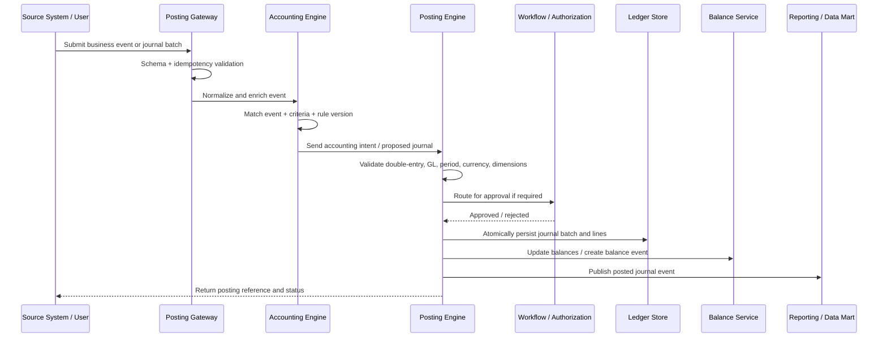
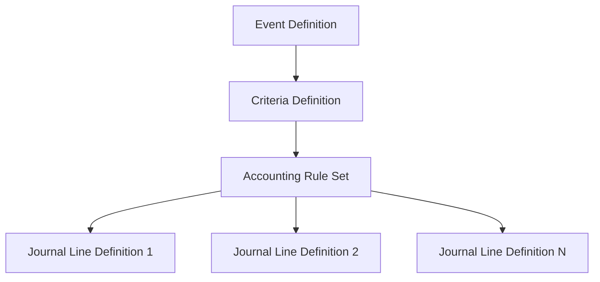

# Posting Engine Design

**Document version:** 1.0  
**Prepared date:** 20 April 2026  
**Target domain:** Event-driven posting engine for enterprise GL, wealth, trust, and fund accounting  
**Purpose:** Define the posting engine that converts business events into balanced, authorized, immutable journal entries.

---

## 1. Source Basis

This design is based on the uploaded GL, Accounting Engine, Fund Accounting, and FRPTI Product Adoption Documents.

| Source document | Posting engine inputs used |
|---|---|
| `Accounting_PAD_v1.2_clean.docx` | Event definition, criteria definition, accounting entry definition, online/batch processing, store-and-forward, rule-driven accounting, event/criteria/accounting-entry gaps. |
| `GL_ProductAdoption_Doc_CBC_Ver1.6.docx` | GL posting, manual/file/interface posting, auto-authorization for upstream systems, adjustment authorization, cancellation, EOD, FCY revaluation, year-end, GL drilldown. |
| `CBC-Intellect Product Adoption Document_Fund Accounting Module_V1.3.docx` | Accounting rules, transaction entry/upload, transaction authorization, reversal authorization, fees, NAV, valuation, accruals, amortization, EOD/SOD, portfolio classification. |
| `FRPTI_PAD_v1.1.docx` | FRPTI classification and GL extraction requirements for regulatory reporting. |

---

## 2. Design Objective

The Posting Engine must provide a deterministic, auditable, rule-driven mechanism for converting business events into accounting entries. It must support online posting, batch upload, manual postings, EOD/SOD postings, NAV postings, FX revaluation, valuation, accruals, and year-end transfers.

Core objective:

> No financial balance should change unless a valid, balanced, traceable, authorized journal batch is posted by the engine.

---

## 3. Posting Engine Responsibilities

The Posting Engine is responsible for:

1. Receiving accounting intents from the Accounting Rule Engine.
2. Generating debit and credit journal lines.
3. Validating GL, dimension, currency, period, and balance rules.
4. Enforcing maker/checker and auto-authorization policy.
5. Posting journal entries atomically.
6. Updating ledger balances or emitting balance-update events.
7. Handling cancellations and reversals using compensating entries.
8. Publishing posting status to upstream systems.
9. Providing traceability from journal line back to source event and rule version.
10. Supplying journal data to reporting, GL drilldown, FRPTI, NAV, and audit services.

The Posting Engine must **not** contain product-specific accounting logic hard-coded in application code. Product-specific behavior belongs in event definitions, criteria, and accounting rules.

---

## 4. Conceptual Flow



---

## 5. Input Types

### 5.1 Online Business Event

Used by upstream systems for real-time posting.

Examples:

- Subscription.
- Redemption.
- Buy trade.
- Sell trade.
- Fee charge.
- Coupon accrual.
- Deposit interest accrual.
- Corporate action.
- Settlement event.

### 5.2 Manual Journal Entry

Used by back office users for adjustments.

Characteristics:

- Requires maker/checker.
- Must support JV, BK, and BT-style postings.
- Must support transaction date, value date, GL head, fund, security, currency, amount, conversion rate, narration, and references.
- Must block GLs configured as not allowed for manual transactions.

### 5.3 Batch Upload

Used for bulk postings.

Characteristics:

- Predefined file format.
- Batch-level validation.
- Row-level validation.
- Debit/credit equality validation.
- Maker/checker approval.
- Reprocessing support with idempotency.

### 5.4 EOD/SOD/System Events

Used for scheduled accounting.

Examples:

- Security coupon accrual.
- Deposit accrual.
- Amortization.
- Mark-to-market valuation.
- FX revaluation.
- Security redemption due.
- Deposit maturity.
- NAV finalization.
- Year-end transfer.

---

## 6. Canonical Posting Request

```json
{
  "source_system": "WEALTH",
  "source_event_id": "WEALTH-20260420-000123",
  "idempotency_key": "WEALTH:SUBSCRIPTION:20260420:000123",
  "event_code": "SUBSCRIPTION_CONFIRMED",
  "business_date": "2026-04-20",
  "transaction_date": "2026-04-20",
  "value_date": "2026-04-20",
  "posting_mode": "ONLINE",
  "accounting_unit": "TRUST-AU-001",
  "fund_code": "FUND001",
  "portfolio_code": "PORT001",
  "account_number": "ACC123456",
  "contract_number": "TRUST-CONTRACT-001",
  "currency": "PHP",
  "amounts": {
    "transaction_amount": "1000000.00",
    "fee_amount": "2500.00",
    "tax_amount": "0.00"
  },
  "dimensions": {
    "product_class": "TRUST",
    "customer_type": "INDIVIDUAL_TRUST",
    "frpti_contractual_relationship": "TRUST",
    "discretionary_flag": true
  },
  "narration": "Subscription confirmed for portfolio PORT001"
}
```

---

## 7. Canonical Journal Batch

```json
{
  "batch_id": "GLB-20260420-000045",
  "source_system": "WEALTH",
  "source_event_id": "WEALTH-20260420-000123",
  "event_code": "SUBSCRIPTION_CONFIRMED",
  "rule_version": "SUBSCRIPTION_TRUST_V7",
  "transaction_date": "2026-04-20",
  "value_date": "2026-04-20",
  "posting_date": "2026-04-20T12:10:30+05:30",
  "accounting_unit": "TRUST-AU-001",
  "status": "POSTED",
  "lines": [
    {
      "line_no": 1,
      "dr_cr": "DR",
      "gl_head": "CASH_AT_BANK",
      "gl_access_code": "100100",
      "currency": "PHP",
      "amount": "1000000.00",
      "base_currency": "PHP",
      "base_amount": "1000000.00",
      "fund_code": "FUND001",
      "portfolio_code": "PORT001",
      "account_number": "ACC123456",
      "contract_number": "TRUST-CONTRACT-001",
      "frpti_code": "MAIN_ASSET_CASH"
    },
    {
      "line_no": 2,
      "dr_cr": "CR",
      "gl_head": "CLIENT_ACCOUNTABILITY",
      "gl_access_code": "200100",
      "currency": "PHP",
      "amount": "1000000.00",
      "base_currency": "PHP",
      "base_amount": "1000000.00",
      "fund_code": "FUND001",
      "portfolio_code": "PORT001",
      "account_number": "ACC123456",
      "contract_number": "TRUST-CONTRACT-001",
      "frpti_code": "MAIN_ACCOUNTABILITY_TRUST"
    }
  ]
}
```

---

## 8. Posting Lifecycle

### Step 1 — Receive Event or Batch

The gateway receives a business event, manual journal, or file batch.

Validation:

- Valid source system.
- Valid event code.
- Valid idempotency key.
- Valid payload schema.
- Valid business date.
- Payload hash captured.

### Step 2 — Normalize and Enrich

The platform enriches the event using master data.

Enrichment examples:

- GL access code.
- Accounting unit.
- Fund currency.
- Security currency.
- Issuer/counterparty FRPTI classification.
- Product class.
- Contractual relationship.
- Portfolio classification.
- Tax treatment.
- Applicable accounting standard.
- FX conversion rate.

### Step 3 — Identify Event and Criteria

The Accounting Engine selects the event and criteria definition.

Selection dimensions may include:

- Event name.
- Product/sub-asset.
- Transaction type.
- Purchase/sale/none.
- Fund.
- Security.
- Holding classification.
- Customer type.
- Product class.
- Currency.
- Value date.
- Accounting standard.

### Step 4 — Resolve Accounting Rule

The engine resolves accounting entries from rule definitions.

Rule definition includes:

- Debit/credit.
- GL category or GL selector.
- Amount field or expression.
- Currency.
- Transaction date.
- Generation date.
- Value date.
- Posting trigger.
- Narration.
- Dimensions.

### Step 5 — Generate Proposed Journal

The Accounting Engine creates a proposed journal batch. At this stage, no ledger balance changes.

### Step 6 — Validate Proposed Journal

The Posting Engine validates:

1. Batch has at least two lines.
2. Total debit equals total credit.
3. Amounts are positive and within precision rules.
4. GL head exists.
5. GL head is open.
6. GL category is compatible with GL type.
7. Currency is allowed for the GL.
8. Accounting unit exists.
9. Fund/portfolio exists where mandatory.
10. FRPTI mapping exists where required.
11. Financial period is open.
12. Backdated posting policy is satisfied.
13. Manual posting is allowed for selected GLs.
14. Conversion rate exists when currency conversion is required.
15. Narration and cancellation/reversal reason exist where mandatory.

### Step 7 — Route Authorization

Authorization policy depends on posting source and posting type.

| Posting type | Authorization policy |
|---|---|
| Trusted upstream interface | Auto-authorized if source is certified and validation passes. |
| Manual journal | Maker/checker mandatory. |
| Batch upload | Maker/checker mandatory unless configured otherwise. |
| EOD generated posting | Auto-authorized after EOD pre-checks and operator approval. |
| NAV finalization posting | Generated only after authorized final NAV process. |
| Cancellation/reversal | Maker/checker mandatory. |
| Year-end posting | Restricted role and approval mandatory. |

### Step 8 — Post Atomically

Atomic posting means:

- Journal batch persisted.
- Journal lines persisted.
- Balances updated or balance update events emitted.
- Posting status updated.
- Audit log written.
- Commit succeeds or rolls back as one unit.

### Step 9 — Publish Posting Result

The engine publishes:

- Posting status.
- Batch ID.
- Journal line references.
- Rejection reasons if any.
- Downstream events for reporting, reconciliation, and data mart.

---

## 9. Accounting Rule Model

### 9.1 Rule Hierarchy



### 9.2 Event Definition

Fields:

| Field | Description |
|---|---|
| Product | Product or line of business. |
| Event code | System event identifier. |
| Event name | User-readable event name. |
| Payload schema | Required event fields and types. |
| Posting mode | Online, batch, EOD, SOD, MOD, manual. |
| Authorization policy | Auto/manual approval policy. |

### 9.3 Criteria Definition

Fields:

| Field | Description |
|---|---|
| Event name | Event selected from event registry. |
| Product/sub-asset | Asset class or sub-product. |
| Criteria name | Descriptive name. |
| Field name | Attribute used for criteria matching. |
| Relation | `=`, `!=`, `in`, `not in`, `>`, `<`, etc. |
| Field value | Literal value or expression. |
| Priority | Used when multiple criteria match. |
| Effective date | Rule start date. |
| Expiry date | Optional rule end date. |

### 9.4 Accounting Entry Definition

Fields:

| Field | Description |
|---|---|
| Accounting ID | Unique ID for a set of accounting entries. |
| Transaction date | Event date field used as transaction date. |
| Generation date | Date on which entry is generated. |
| Value date | Event date field used as value date. |
| Posting trigger | Date or process that triggers posting. |
| GL category / GL selector | Static GL, table field, expression, operative account, pool account, custody account, etc. |
| Dr/Cr | Debit, credit, or based on sign. |
| Amount type | Field or expression. |
| Amount field | Event amount field. |
| Amount expression | Arithmetic expression over fields. |
| Currency | Posting currency expression. |
| Accounting standard | Applicable book/standard. |
| Narration | Template. |

---

## 10. Rule Examples

### 10.1 Manual Journal Voucher

Criteria:

- Event: `MANUAL_JV_POSTED`
- Transaction type: `JV`
- Posting mode: manual

Posting behavior:

- User enters all journal lines.
- Engine validates lines but does not infer GLs.
- Maker/checker required.
- Manual-restricted GLs blocked.

### 10.2 Fee Accrual During NAV Finalization

Criteria:

- Event: `NAV_FINALIZED`
- Fee type: management fee
- Fund: optional or all funds
- Basis: NAV / market value / unit capital

Posting behavior:

- Debit expense or fund liability GL.
- Credit accrued fee payable GL.
- Post only when NAV is final.
- Draft NAV computes but does not post.

### 10.3 FX Revaluation

Criteria:

- Event: `EOD_FX_REVALUATION`
- GL revaluation enabled.
- Currency not base currency.

Posting behavior depends on GL balance nature and rate movement:

- If debit balance increases in base currency: debit FCY GL base equivalent, credit revaluation gain.
- If debit balance decreases: debit revaluation loss, credit FCY GL base equivalent.
- If credit balance increases: debit revaluation loss, credit FCY GL base equivalent.
- If credit balance decreases: debit FCY GL base equivalent, credit revaluation gain.

### 10.4 Portfolio Classification Valuation

Criteria:

- Event: `MTM_VALUATION`
- Classification: AFS, HFT, FVPL, FVTPL, FVOCI, HTM, HTC.

Posting behavior:

- AFS: fair-value change posted to configured AFS fair-value GL.
- HFT/FVPL/FVTPL/FVOCI: unrealized gain/loss posted to configured income or OCI-related GL according to policy.
- HTM/HTC: no MTM posting; amortized-cost treatment applies.

---

## 11. Validation Rules

### 11.1 Structural Validations

- Batch must contain one or more debit lines and one or more credit lines.
- Total debit must equal total credit.
- Batch serials must belong to one transaction batch.
- Amount precision must follow currency precision.
- NAV precision must follow fund parameter.
- Unit precision must follow fund parameter.

### 11.2 Master Validations

- GL exists and is active.
- GL is not closed.
- GL category exists.
- GL type is valid.
- GL category must match GL type for income and expenditure GLs.
- Currency exists.
- Currency allowed for GL.
- Fund exists.
- Portfolio exists.
- Security exists where required.
- Counterparty/issuer exists where required.
- Accounting unit exists.
- FRPTI classification exists where required.

### 11.3 Date Validations

- Value date cannot be future-dated unless event explicitly allows future accounting.
- Backdated posting allowed only for current financial year unless configured.
- Previous financial-year posting requires special control and authorization.
- Closed periods cannot be posted unless reopening policy allows.
- NAV finalization cannot occur if required checks fail.

### 11.4 Authorization Validations

- Maker cannot approve own transaction.
- Last modifier cannot approve own change.
- Unauthorized master data blocks dependent processing where configured.
- Reversal requires reason.
- Cancellation requires reason.
- Year-end requires restricted approval.

### 11.5 EOD/NAV Validations

Before NAV finalization:

- Unauthorized fund records check.
- Unauthorized fund-accounting masters check.
- Unconfirmed deals check.
- Unsettled deal check for the date/fund.
- Latest price upload check.
- Latest exchange rate upload check.

Before EOD:

- Required FX rates available.
- EOD jobs not already completed for same business date unless rerun policy allows.
- Pending critical errors resolved or explicitly waived.

---

## 12. Balance Update Design

### 12.1 Atomic Balance Update

When a journal batch posts, balances are updated by dimension set.

Dimension set may include:

- GL head.
- GL access code.
- Accounting unit.
- Fund.
- Portfolio.
- Account.
- Contract.
- Security.
- Counterparty.
- Currency.
- Book/accounting standard.
- Value date.

### 12.2 Balance Fields

- Opening balance.
- Debit turnover.
- Credit turnover.
- Closing balance.
- FCY balance.
- Base-currency balance.
- Last posting reference.

### 12.3 Balance Rebuild

The platform must support balance rebuild from immutable journal lines.

Use cases:

- Disaster recovery.
- Audit validation.
- Reporting discrepancy investigation.
- Migration validation.
- Rule regression testing.

---

## 13. Cancellation and Reversal

### 13.1 Cancellation

Cancellation applies to a posted transaction batch and requires:

- Transaction branch/accounting unit.
- Transaction batch number.
- Transaction date.
- Reason for cancellation.
- Authorization.

Cancellation result:

- Original batch remains posted.
- Cancellation batch is created with compensating lines.
- Original and cancellation batches are linked.
- Balance impact nets to zero as of configured value/posting date.

### 13.2 Reversal

Reversal applies to entries such as manual transactions, NAV, amortization schedules, investment journals, and year-end where supported.

Rules:

- Reversal must never edit original journal lines.
- Reversal must create a new batch.
- Reversal must carry reason, maker, checker, and original reference.
- NAV reversal may be limited to previous NAV date.
- Fund EOY reversal must be restricted.

---

## 14. Backdated Posting Policy

The system must support backdated posting for the current financial year. Prior financial-year posting must be controlled.

Policy options:

1. Block previous-year posting completely.
2. Allow previous-year posting only after period reopening.
3. Allow previous-year posting into adjustment period.
4. Allow previous-year posting with elevated approval and audit flag.

Recommended default:

- Current financial-year backdated posting allowed with validation.
- Previous financial-year posting blocked unless explicitly configured and approved.
- Closed reporting periods require adjustment-period posting.

---

## 15. FX Revaluation Posting Design

### 15.1 Inputs

- FCY GL list enabled for revaluation.
- Effective date.
- Revaluation frequency.
- FCY balance.
- Existing base-currency balance.
- Closing mid-rate.
- Gain GL.
- Loss GL.
- Accounting unit/fund/portfolio dimensions.

### 15.2 Computation

```text
new_base_equivalent = fcy_balance * closing_mid_rate
revaluation_amount = new_base_equivalent - existing_base_equivalent
```

### 15.3 Posting Matrix

| GL balance nature | Base equivalent movement | Posting |
|---|---|---|
| Debit balance | Increase | Dr FCY GL, Cr FX revaluation gain |
| Debit balance | Decrease | Dr FX revaluation loss, Cr FCY GL |
| Credit balance | Increase | Dr FX revaluation loss, Cr FCY GL |
| Credit balance | Decrease | Dr FCY GL, Cr FX revaluation gain |

### 15.4 Controls

- FX rates must exist before EOD.
- Revaluation parameters must be effective-dated.
- Gain/loss GL must be configured.
- Revaluation posting must be traceable to rate used.
- Reports must show currency-wise FCY balance, rate, old base, new base, and difference.

---

## 16. NAV and Fund Accounting Posting Design

### 16.1 Draft NAV

Draft NAV:

- Computes accruals, valuation, fees, gross NAV, net NAV, NAVPU.
- Does not post computed fee accounting entries.
- Can be run multiple times.

### 16.2 Final NAV

Final NAV:

- Can be run only by entitled users.
- Posts computed fees and other final postings.
- Freezes NAV for the date.
- Sets next NAV date.
- Prevents further modification unless reversed.

### 16.3 NAV Posting Inputs

- Fund code.
- NAV date.
- Previous NAV date.
- Next NAV date.
- Fund currency.
- Outstanding units.
- Accrued income.
- Accrued expenses.
- Market values.
- Book values.
- Fee amounts.
- Tax amounts.
- FX rates.

### 16.4 NAV-Related Posting Types

- Fee accrual.
- Fee override.
- Tax on interest accrual.
- Amortization.
- Unrealized gain/loss.
- Realized gain/loss.
- Portfolio closure.
- NAV reversal.

---

## 17. Portfolio Classification Posting Design

### 17.1 Supported Classifications

- AFS — Available for Sale.
- HFT — Held for Trading.
- HTM — Held to Maturity.
- FVPL — Fair Value Profit or Loss.
- FVTPL — Fair Value Through Profit or Loss.
- FVOCI — Fair Value Other Comprehensive Income.
- HTC — Held Till Close.

### 17.2 Valuation Behavior

| Classification | Valuation behavior | Posting behavior |
|---|---|---|
| AFS | Market value compared with book value | Change in fair value posted to configured fair-value GL. |
| HFT / FVPL / FVTPL / FVOCI | Market value compared with investment value | Unrealized gain/loss posted to configured GL. |
| HTM / HTC | Valued at cost/amortized cost | No MTM posting. |

### 17.3 Portfolio Closure

- AFS: impairment loss may change book value; otherwise no book-value change.
- HFT/FVPL/FVTPL/FVOCI: book value changed to market value.
- HTM/HTC: no portfolio-closure impact.

---

## 18. Year-End Posting Design

### 18.1 Inputs

- Financial year.
- Transaction code for P/L transfer.
- Expense transfer GL.
- Income transfer GL.
- Retained earnings or reserve GL.
- Fund or entity scope.

### 18.2 Process

1. Validate transaction code and transfer GL parameters.
2. Identify income and expense GL balances.
3. Generate closing journal batch.
4. Transfer net profit/loss to retained earnings or reserve account.
5. Close income and expense balances.
6. Lock year-end result.
7. Produce year-end report and audit trail.

### 18.3 Controls

- Restricted role.
- Maker/checker.
- No duplicate final year-end run.
- Reversal only under restricted approval.
- All year-end postings must be traceable.

---

## 19. Error Handling

### 19.1 Error Categories

| Category | Examples | Handling |
|---|---|---|
| Schema error | Missing mandatory field, invalid data type | Reject before rule evaluation. |
| Master data error | Invalid GL, invalid fund, missing FRPTI classification | Reject or route to exception queue. |
| Rule error | No matching rule, ambiguous rules, invalid amount expression | Reject and alert rule owner. |
| Validation error | Batch not balanced, closed period, manual GL blocked | Reject with detailed reason. |
| Authorization error | Maker equals checker, approval expired | Keep pending or reject. |
| System error | Database failure, timeout | Retry if safe; otherwise mark failed and preserve idempotency. |

### 19.2 Exception Queue

The exception queue must show:

- Event ID.
- Source system.
- Error category.
- Error message.
- Business date.
- Current owner.
- Retry eligibility.
- Related master/rule object.

---

## 20. API Endpoints

### 20.1 Posting APIs

| Endpoint | Method | Purpose |
|---|---|---|
| `/posting/events` | POST | Submit business event for accounting. |
| `/posting/journals/manual` | POST | Create manual journal proposal. |
| `/posting/batches/upload` | POST | Upload batch file. |
| `/posting/batches/{id}/validate` | POST | Validate batch before approval/posting. |
| `/posting/batches/{id}/approve` | POST | Approve pending batch. |
| `/posting/batches/{id}/reject` | POST | Reject pending batch. |
| `/posting/batches/{id}/cancel` | POST | Create cancellation request. |
| `/posting/batches/{id}/reverse` | POST | Create reversal request. |
| `/posting/batches/{id}` | GET | Retrieve batch status and lines. |

### 20.2 Rule APIs

| Endpoint | Method | Purpose |
|---|---|---|
| `/accounting/events` | POST/GET | Maintain event definitions. |
| `/accounting/criteria` | POST/GET | Maintain criteria definitions. |
| `/accounting/rules` | POST/GET | Maintain accounting entry definitions. |
| `/accounting/rules/{id}/simulate` | POST | Simulate rule against sample event. |
| `/accounting/rules/{id}/approve` | POST | Approve rule version. |

### 20.3 Query APIs

| Endpoint | Method | Purpose |
|---|---|---|
| `/ledger/balances` | GET | Query balances by dimension. |
| `/ledger/journals` | GET | Query journal lines. |
| `/ledger/gl-drilldown` | GET | Drill down by accounting unit, GL access code, and date interval. |
| `/ledger/revaluation-report` | GET | FX revaluation report. |
| `/ledger/audit/{batch_id}` | GET | Audit trace for batch. |

---

## 21. Database Tables

### 21.1 Core Tables

| Table | Purpose |
|---|---|
| `business_event` | Raw and normalized business event. |
| `accounting_intent` | Event matched to rule/criteria. |
| `journal_batch` | Batch header. |
| `journal_line` | Debit/credit lines. |
| `ledger_balance` | Current balance by dimension. |
| `ledger_balance_snapshot` | Daily/period balance snapshots. |
| `authorization_task` | Maker/checker workflow. |
| `reversal_link` | Original-to-reversal/cancellation link. |
| `posting_exception` | Error and exception queue. |
| `audit_log` | Immutable audit events. |

### 21.2 Rule Tables

| Table | Purpose |
|---|---|
| `event_definition` | Event registry. |
| `criteria_definition` | Criteria header. |
| `criteria_condition` | Criteria field/relation/value. |
| `accounting_rule_set` | Rule version header. |
| `accounting_entry_definition` | Journal line generation logic. |
| `rule_test_case` | Example input and expected journal. |

### 21.3 Master Tables

| Table | Purpose |
|---|---|
| `gl_category` | GL categories. |
| `gl_head` | GL heads. |
| `gl_hierarchy` | COA hierarchy. |
| `gl_access_code` | GL access mapping. |
| `gl_manual_restriction` | GLs not allowed for manual transactions. |
| `accounting_unit` | Accounting unit/branch. |
| `fund_master` | Fund parameters. |
| `portfolio_master` | Portfolio master. |
| `security_master` | Security/instrument master. |
| `counterparty_master` | Issuer/counterparty master. |
| `frpti_mapping` | FRPTI mapping. |
| `fx_rate` | FX rates. |
| `revaluation_parameter` | FCY revaluation setup. |

---

## 22. Testing Strategy

### 22.1 Golden Accounting Tests

Each accounting rule must include:

- Sample event payload.
- Expected debit lines.
- Expected credit lines.
- Expected dimensions.
- Expected amounts.
- Expected currency conversion.
- Expected rejection cases.

### 22.2 Invariant Tests

Automated tests must enforce:

- Debits equal credits.
- Posted entries are immutable.
- Duplicate idempotency key does not duplicate posting.
- Maker cannot approve own transaction.
- Closed GL cannot receive postings.
- Closed period cannot receive postings.
- Balance rebuild equals stored balances.
- Reversal nets to zero with original batch.
- FX revaluation does not alter FCY amount.

### 22.3 Simulation Tests

Before rule activation:

- Simulate against historical events.
- Compare with expected journals.
- Compare report impacts.
- Verify no unmapped FRPTI lines.
- Verify no orphan dimensions.

---

## 23. AI Development Guardrails for Posting Engine

AI coding assistants can help generate APIs, test scaffolds, validators, and documentation. They must not independently design or alter accounting semantics.

Mandatory guardrails:

1. All posting logic must be covered by golden accounting tests.
2. Rule DSL must be reviewed by accounting SMEs.
3. AI-generated code cannot bypass posting validators.
4. AI-generated SQL cannot update posted journals directly.
5. Any change to balance logic requires reconciliation tests.
6. Any rule change requires before/after journal simulation.
7. All generated code must pass static analysis and security scanning.
8. Pull requests must include source requirement reference and test evidence.
9. Production rule changes must be versioned and authorized.
10. Developers must never rely on AI output for accounting correctness without domain validation.

---

## 24. Acceptance Criteria

The Posting Engine is acceptable when:

1. It can accept online, manual, batch, and EOD postings.
2. It prevents unbalanced postings.
3. It prevents duplicate postings from duplicate source events.
4. It supports maker/checker for manual and batch postings.
5. It supports auto-authorization for certified upstream interfaces.
6. It supports cancellation and reversal with immutable audit trail.
7. It supports FX revaluation posting.
8. It supports NAV finalization postings and draft NAV non-posting behavior.
9. It supports year-end P/L transfer.
10. It supports GL drilldown to transaction level.
11. It supports FRPTI dimensions and mappings.
12. It can rebuild balances from journals.
13. It provides complete traceability from journal line to source event, rule version, and authorization.
